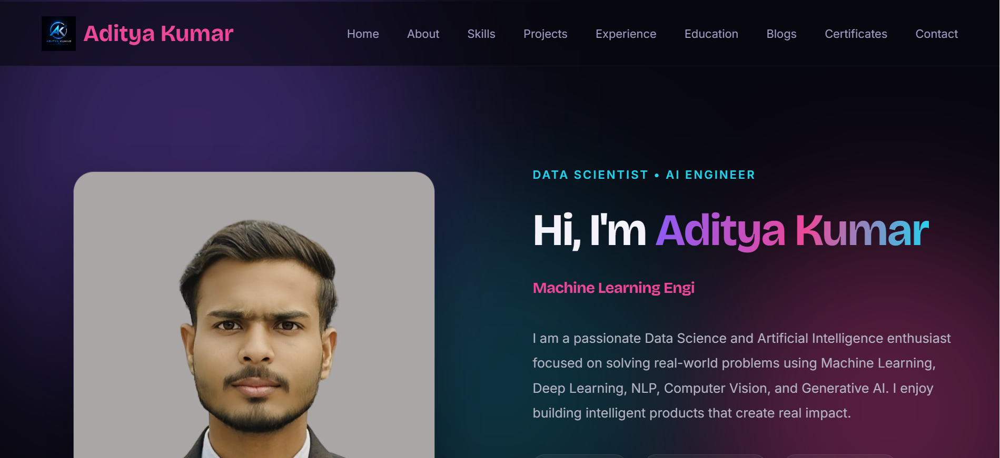

# 🚀 Aditya Kumar | Data Science & AI Portfolio

A modern, responsive, and interactive portfolio showcasing my journey in **Data Science, Artificial Intelligence, Machine Learning, and Generative AI**.
## 📸 Portfolio Preview



🔗 **[ 🌐 Live Demo](https://portfolio-eight-tau-ijr9l79wh2.vercel.app/))**

---


## 📌 About

This portfolio showcases my:

- 🎓 Education
- 💼 Experience
- 🏆 Certifications
- 💻 Technical Skills
- 🤖 AI & Machine Learning Projects
- 📄 Resume
- 📚 Blog
- 📬 Contact Form

The portfolio is designed with a modern **glassmorphism interface**, responsive layouts, smooth animations, and interactive components.

---

## ✨ Features

- ⚡ Modern Dark UI
- 📱 Fully Responsive Design
- 🎯 Interactive Hero Section
- 🤖 AI Chat Assistant
- 🧠 Animated Skills Showcase
- 🏆 Certificate Gallery
- 💼 Experience Timeline
- 🎓 Education Timeline
- 📚 Blog Section
- 📬 EmailJS Contact Form
- 🎨 Smooth Scroll Animations
- 🌌 Glassmorphism Design
- 🔗 Social Media Integration

---

## 🛠️ Tech Stack

### Frontend

- HTML5
- CSS3
- JavaScript (ES6)

### Libraries & Services

- EmailJS
- Font Awesome

### Design

- Glassmorphism
- CSS Animations
- Responsive Design
- Gradient Effects
- Interactive UI Components

---

## 📂 Project Structure

```text
personal-portfolio/
│
├── index.html
├── style.css
├── script.js
│
├── images/
│   ├── profile.jpg
│   ├── logo.png
│   ├── screenshot.png
│   └── ...
│
├── certificates/
│   ├── codsoft-data-science.png
│   ├── iit-kanpur-training.png
│   └── nptel-python.png
│
├── resume/
│   └── resume.pdf
│
└── README.md
```

---

## 📖 Portfolio Sections

- 🏠 Home
- 👨‍💻 About
- 🛠️ Skills
- 🚀 Projects
- 💼 Experience
- 🎓 Education
- 🏆 Certificates
- 📚 Blog
- 📬 Contact

---

## 🤖 Technical Skills

### Programming

- Python
- SQL
- R
- JavaScript

### Data Science

- Pandas
- NumPy
- Scikit-learn
- Matplotlib
- Seaborn

### Machine Learning

- Regression
- Classification
- Clustering
- Feature Engineering
- Model Evaluation
- Predictive Analytics

### Deep Learning

- TensorFlow
- PyTorch

### Generative AI & NLP

- OpenAI API
- LangChain
- NLP
- LLM Applications
- RAG

### Visualization

- Power BI
- Streamlit
- Matplotlib
- Seaborn

### Tools & Development

- Git
- GitHub
- Docker
- FastAPI
- PostgreSQL

---

## 🏆 Certifications

- **Data Science Internship** — CodSoft
- **Winter Training Program in Full Stack Web Development** — E&ICT Academy, IIT Kanpur
- **Python for Data Science** — NPTEL, IIT Madras

---

## 💼 Featured Projects

### 🤖 AI-Powered Financial Assistant

Conversational AI application designed to analyze personal financial information and provide intelligent financial insights.

**Technologies:** Python, LangChain, OpenAI API, FastAPI, PostgreSQL

---

### 📊 Customer Churn Prediction

Machine Learning project that predicts customers who are likely to churn and helps businesses develop proactive customer retention strategies.

**Technologies:** Python, Pandas, Scikit-learn, XGBoost, Power BI

---

### 🏠 Real Estate Price Prediction

Machine Learning application for predicting real estate prices using property-related features and an interactive Streamlit interface.

**Technologies:** Python, Pandas, NumPy, Scikit-learn, Streamlit

---

### 📰 Fake News Detection

Machine Learning-based application for classifying news articles as real or fake using Natural Language Processing techniques.

**Technologies:** Python, NLP, TF-IDF, Scikit-learn

---

### 🛡️ Credit Card Fraud Detection

Machine Learning model designed to identify potentially fraudulent credit card transactions.

**Technologies:** Python, Pandas, NumPy, Scikit-learn

---

## 📧 Contact

I'm always open to connecting, discussing ideas, and collaborating on interesting projects.

- 📩 **Email:** [Adityapandeykv19@gmail.com](mailto:Adityapandeykv19@gmail.com)
- 💼 **LinkedIn:** [Aditya Kumar](https://www.linkedin.com/in/aditya-kumar-data)
- 💻 **GitHub:** [Adityaweb1](https://github.com/Adityaweb1)

---

## 🌐 Live Portfolio

**[🚀 Visit My Portfolio](https://portfolio-aditya-b74b.vercel.app/)**

---

## 🚀 Run Locally

Clone the repository:

```bash
git clone https://github.com/Adityaweb1/personal-portfolio.git
```

Navigate to the project:

```bash
cd personal-portfolio
```

Open `index.html` in your browser.

Alternatively, use **VS Code Live Server** to run the portfolio locally.

---

## 📬 EmailJS Configuration

The contact form uses **EmailJS** to send messages directly from the portfolio.

Configure the following in `script.js`:

- Service ID
- Template ID
- Public Key

> ⚠️ Do not expose private API keys or sensitive credentials in the repository.

---

## 🌟 Future Improvements

- 📝 Blog CMS Integration
- 🔎 Project Filtering
- 🌗 Light/Dark Theme Toggle
- 📊 Visitor Analytics
- 🤖 AI Resume Assistant
- 🌍 Multi-language Support
- 📱 Progressive Web App (PWA)
- ☁️ Backend Integration

---

## 📄 License

This project is licensed under the **MIT License**.

---

## 👨‍💻 Author

# Aditya Kumar

**Data Science | Artificial Intelligence | Machine Learning | Generative AI**

🌐 **[Portfolio](https://portfolio-aditya-b74b.vercel.app/)**  
💻 **[GitHub](https://github.com/Adityaweb1)**  
💼 **[LinkedIn](https://www.linkedin.com/in/aditya-kumar-data)**

---

⭐ If you like this portfolio, consider giving the repository a **Star** on GitHub!
